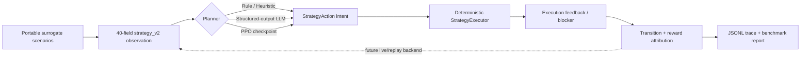

# Hybrid Game AI Strategy Lab

## 项目定位

这是一个面向“大模型游戏应用开发 / 游戏 AI 工程”岗位的混合智能体项目：

- StarCraft II 规则 Bot 负责经济、建造、生产和确定性执行；
- LLM 负责低频、可解释的高层战略意图；
- PPO 提供标准 Gymnasium / Stable-Baselines3 策略接口；
- Strategy Lab 在不启动 SC2、不调用 API、不训练模型时完成策略对比、故障回退、指标统计和决策追踪。

项目展示的是可迁移到 RTS、MOBA、开放世界 NPC 或自动战斗系统的工程方法，不宣称已经训练出高胜率模型。

## 30 秒演示

只运行本地代理场景：

```powershell
.\.venv\Scripts\python.exe scripts\benchmark_strategy_lab.py `
  --policies heuristic random stay-course `
  --episodes-per-scenario 4
```

输出标准实验目录：

```text
runs/<timestamp>_strategy-policy-lab/
  metadata.json
  artifacts/strategy_lab_report.json
  logs/strategy_decisions.jsonl
```

只检查 PPO 配置，不训练：

```powershell
.\.venv\Scripts\python.exe scripts\train_ppo.py `
  --backend surrogate `
  --dry-run `
  --total-timesteps 100000
```

## 架构



核心约束是“模型选择意图，确定性代码掌握执行权”。LLM 或 PPO 只能选择 8 个稳定宏观动作，执行器继续检查资源、科技和战场条件。

## 五项核心能力

### 1. 混合智能体分层

- Rule Bot：稳定 baseline 与安全执行层；
- LLM planner：严格 JSON Schema、解释和置信度；
- PPO policy：同一观测和动作空间上的可替换策略；
- fallback：超时、解析错误、无密钥或策略异常时回退到 `STAY_COURSE`。

低频战略与实时微操分离，避免把网络延迟和不确定输出带入逐帧控制。

### 2. 严格 transition contract

PPO backend 必须返回：

```text
state_before -> action -> execution_result -> state_after
```

环境会拒绝与当前状态不一致的 `state_before`，防止把执行后的 observation 错当成决策输入。

### 3. 可重复的离线 Strategy Lab

内置五类 deterministic surrogate 场景：

- `economic_expansion`：扩张与补农民；
- `ground_rush`：静态防御与紧急补兵；
- `armored_assault`：Robotics 科技与 Immortal 反制；
- `production_scaling`：双矿产能扩张；
- `upgrade_window`：安全升级窗口。

这些场景用于验证工程链路和比较策略行为，不是 SC2 仿真。报告会明确标注“代理指标不等于真实胜率”。

### 4. 评测与可观测性

统一报告包含：

- episode 数、代理胜率、平均 reward 和平均步数；
- 动作分布、有效执行率和阻塞动作率；
- policy fallback 次数；
- 决策延迟 mean / p50 / p95；
- 分场景结果；
- 每一步 reward components。

JSONL trace 记录策略来源、动作、解释、置信度、阻塞原因、异常、延迟和目标进度，便于复盘 LLM、PPO 与规则策略的差异。

### 5. 成本与安全控制

- benchmark 默认只运行本地 baseline；
- LLM benchmark 必须显式指定 `--policies llm --allow-llm-api`；
- 默认游戏运行仍是 `--strategy-policy rule`；
- surrogate checkpoint 不标记为 promotion-ready；
- 没有 live backend 时不把代理结果描述成真实对战能力。

## 代码导览

| 模块 | 作用 |
| --- | --- |
| `rl/ppo_types.py` | transition 与 backend Protocol |
| `rl/ppo_env.py` | Gymnasium 环境和状态一致性检查 |
| `rl/ppo_surrogate_backend.py` | 五类代理场景和动作效果 |
| `rl/ppo_rewards.py` | 可解释 reward 分解 |
| `rl/ppo_training.py` | PPO 构建、学习、保存接线 |
| `rl/strategy_lab.py` | 策略适配、fallback、benchmark 和指标聚合 |
| `bot/managers/llm_strategy_policy.py` | 结构化 LLM 战略 planner |
| `bot/managers/ppo_strategy_policy.py` | PPO checkpoint 推理适配器 |
| `scripts/benchmark_strategy_lab.py` | 无 SC2 的一键策略竞技场 |
| `scripts/train_ppo.py` | dry-run、surrogate 或外部 backend 入口 |

## LLM 与 PPO 的统一比较

| 维度 | LLM planner | PPO policy |
| --- | --- | --- |
| 输入 | 同一 40 维 observation | 同一 40 维 observation |
| 输出 | JSON Schema 中的 8 个动作 | `Discrete(8)` |
| 可解释性 | reasoning + confidence | reward 和轨迹归因 |
| 主要风险 | 网络、尾延迟、格式错误、成本 | checkpoint、分布漂移、奖励漏洞 |
| 安全边界 | fallback + executor | executor |
| 评测 | Strategy Lab report | Strategy Lab report |

## 面试中可讲清楚的取舍

1. LLM 只做低频战略，因为实时微操更适合规则或小模型。
2. 保留规则 baseline，确保学习策略可回退、可比较。
3. surrogate 便宜、确定、适合 CI，但不能代替真实环境验证。
4. reward 必须分解，否则无法识别奖励漏洞和错误归因。
5. transition 时序正确性比先调 PPO 超参数更重要。
6. LLM API 必须显式开启，因为成本和尾延迟是产品约束。

## 简历描述参考

> 设计并实现 StarCraft II 混合游戏 AI 框架，将规则执行、结构化 LLM 战略规划与 PPO 策略接口解耦；基于 40 维观测和 8 类宏观动作构建 Gymnasium transition contract、可解释 reward、故障回退与统一离线评测工具，输出逐步 JSONL 决策轨迹和分场景延迟、阻塞、收益指标。

不要写“训练出高胜率 PPO”或“LLM 已显著提升真实对局胜率”，因为当前项目没有进行相应训练和在线实验。

## 后续扩展顺序

未来具备算力和运行条件后再按以下顺序推进：

1. 实现 replay-backed backend，验证真实 `state_before/state_after`；
2. 用规则或 teacher trajectory 做 behavior cloning warm start；
3. 固定评测地图、种族、版本和随机种子；
4. 小规模 PPO 训练并进行 reward hacking 审计；
5. 为 LLM 增加缓存、异步调用、预算控制和 prompt version registry；
6. 通过离线 gate 后再做受限的 guarded online smoke。
