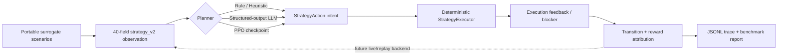

# Hybrid Game AI Strategy Lab

## 概述

Hybrid Game AI Strategy Lab 是 StarCraft II 神族 Bot 的高层策略实验模块，用于验证规则策略、LLM planner 和 PPO policy 在统一观测与动作空间下的协作方式。

系统采用分层设计：

- 规则 Bot 负责经济、建造、生产和确定性执行；
- LLM 负责低频、可解释的战略意图选择；
- PPO 提供标准 Gymnasium / Stable-Baselines3 策略接口；
- Strategy Lab 负责离线场景、策略对比、故障回退、指标统计和决策追踪。

当前版本重点是建立清晰、可运行、可扩展的工程接口，不包含已训练 PPO 模型，也不将代理场景结果视为真实对局成绩。

## 快速开始

运行本地代理场景，不启动 StarCraft II、不调用 LLM API、不训练模型：

```powershell
.\.venv\Scripts\python.exe scripts\benchmark_strategy_lab.py `
  --policies heuristic random stay-course `
  --episodes-per-scenario 4
```

命令会生成标准实验目录：

```text
runs/<timestamp>_strategy-policy-lab/
  metadata.json
  artifacts/strategy_lab_report.json
  logs/strategy_decisions.jsonl
```

只检查 PPO 配置：

```powershell
.\.venv\Scripts\python.exe scripts\train_ppo.py `
  --backend surrogate `
  --dry-run
```

## 架构



核心约束是“模型选择意图，确定性代码掌握执行权”。LLM 或 PPO 只能选择 8 个稳定的宏观动作，执行器继续检查资源、科技前置和战场条件。

## 策略层次

### Rule baseline

规则策略提供稳定的默认行为和回退路径。默认运行模式仍然保持：

```text
--army-policy rule
--strategy-policy rule
--strategy-tactic-mode off
```

### LLM planner

LLM planner 使用严格 JSON Schema 返回：

- `action`：8 个 `StrategyAction` 之一；
- `reasoning`：简短决策说明；
- `confidence`：0 到 1 的置信度。

请求失败、响应解析失败、动作无效或配置缺失时，策略回退到 `STAY_COURSE`。LLM 只选择宏观意图，不直接生成任意游戏命令。

### PPO policy

PPO 层复用相同的 40 维 observation 和 `Discrete(8)` 动作空间。训练接口接受可注入的 `StrategyEnvBackend`，因此代理场景、replay backend 和未来的 live backend 可以共享同一 Gymnasium 环境。

## Transition contract

Backend 必须按以下顺序返回完整 transition：

```text
state_before -> action -> execution_result -> state_after
```

`SC2StrategyPPOEnv` 会检查 `state_before` 是否与环境当前状态一致，避免把执行后的 observation 错当成动作输入。

执行结果包含：

- 是否真正尝试执行；
- 实际 effect；
- blocker；
- 可选单位类型和目标；
- terminated / truncated / outcome；
- backend 附加信息。

## Surrogate scenarios

内置五类 deterministic surrogate 场景：

- `economic_expansion`：扩张与补充工人；
- `ground_rush`：静态防御与紧急补兵；
- `armored_assault`：Robotics 科技与 Immortal 反制；
- `production_scaling`：双基地生产能力扩张；
- `upgrade_window`：安全升级窗口。

这些场景提供简化、可重复的宏观状态变化，用于接口回归和策略行为对比。它们不是 StarCraft II 仿真器。

## Reward attribution

Reward 由多个显式组件构成：

```text
army_delta
worker_delta
base_delta
threat_relief
objective_progress
execution
terminal
clip_adjustment
```

每一步的组件都会写入环境 `info` 和 JSONL trace，便于定位策略是在积累军力、发展经济、解除威胁，还是反复选择不可执行动作。

## 评测输出

统一报告包含：

- episode 数、代理场景完成率、平均 reward 和平均步数；
- 动作分布、有效执行率和阻塞动作率；
- policy fallback 次数；
- 决策延迟 mean / p50 / p95；
- 分场景结果；
- 每一步 reward components。

JSONL trace 记录策略来源、动作、解释、置信度、阻塞原因、异常、延迟和目标进度。

## LLM 与 PPO 的统一接口

| 维度 | LLM planner | PPO policy |
| --- | --- | --- |
| 输入 | 40 维 strategy observation | 40 维 strategy observation |
| 输出 | JSON Schema 中的 8 个动作 | `Discrete(8)` |
| 推理信息 | reasoning + confidence | checkpoint action |
| 主要风险 | 网络延迟、格式错误、调用成本 | 分布漂移、奖励设计、checkpoint 兼容性 |
| 执行边界 | deterministic executor | deterministic executor |
| 评测入口 | Strategy Lab | Strategy Lab |

LLM benchmark 必须显式增加：

```text
--policies llm --allow-llm-api
```

这样默认离线命令不会产生网络请求或 API 费用。

## 代码导览

| 模块 | 作用 |
| --- | --- |
| `rl/ppo_types.py` | transition 与 backend Protocol |
| `rl/ppo_env.py` | Gymnasium 环境和状态一致性检查 |
| `rl/ppo_surrogate_backend.py` | 代理场景和动作效果 |
| `rl/ppo_rewards.py` | 可解释 reward 分解 |
| `rl/ppo_training.py` | PPO 构建、学习和保存接线 |
| `rl/strategy_lab.py` | 策略适配、fallback、benchmark 和指标聚合 |
| `bot/managers/llm_strategy_policy.py` | 结构化 LLM 战略 planner |
| `bot/managers/ppo_strategy_policy.py` | PPO checkpoint 推理适配器 |
| `scripts/benchmark_strategy_lab.py` | 离线策略评测入口 |
| `scripts/train_ppo.py` | dry-run、surrogate 或外部 backend 入口 |

## 当前边界

当前框架不声明：

- surrogate 指标等同于真实 SC2 表现；
- reward 权重已经调优；
- PPO 已经完成训练；
- LLM 或 PPO 已达到在线替换规则策略的条件；
- LLM 尾延迟适合实时对局。

后续如果接入真实数据，应优先实现 replay-backed backend，验证 transition 时序，然后固定评测集、增加 episode holdout，并在训练前建立明确的 promotion gate。
